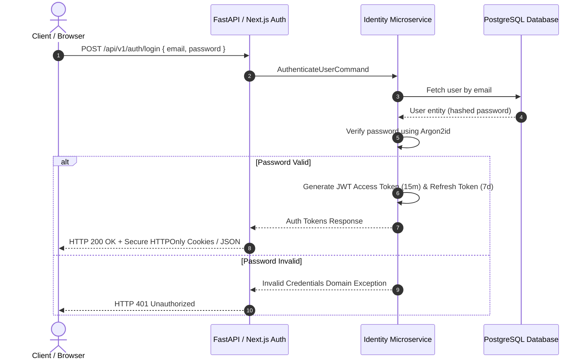

# 06 — Security & Compliance

**Document:** 06_SECURITY_COMPLIANCE.md  
**Owner:** Security Officer & Lead Architect  
**Status:** Active  

---

## Executive Summary

Security and regulatory compliance are integral to the Sathus Platform architecture. Designed for enterprise SaaS deployment, the platform implements zero-trust principles, Argon2id password hashing, JWT stateless access tokens with refresh token rotation, Role-Based Access Control (RBAC), security response headers, input validation at all boundaries, and comprehensive audit logging.

---

## Authentication & Authorization Architecture



### Password Hashing Standards
- Algorithm: **Argon2id** (`passlib.handlers.argon2`).
- Parameters: Time cost = 2, Memory cost = 65536 KiB, Parallelism = 8.
- Plaintext passwords MUST never be logged or stored in temporary storage.

### Token Specification
- **Access Tokens**: Short-lived (15 minutes), signed via HS256 / RS256 algorithm containing `sub` (user_id), `tenant_id`, `roles`, and `exp`.
- **Refresh Tokens**: Long-lived (7 days), stored securely, rotated upon use, and revokable per device session.

---

## Security Response Headers Matrix

All applications (`apps/web`, `apps/admin`) MUST enforce HTTP security headers in `next.config.ts`:

| Header | Value | Purpose |
| :--- | :--- | :--- |
| `X-Frame-Options` | `DENY` | Prevents Clickjacking attacks |
| `X-Content-Type-Options` | `nosniff` | Prevents MIME-type sniffing |
| `Referrer-Policy` | `strict-origin-when-cross-origin` | Protects sensitive URL data |
| `Permissions-Policy` | `camera=(), microphone=(), geolocation=()` | Disables unnecessary browser capabilities |
| `X-XSS-Protection` | `1; mode=block` | Enables browser XSS filtering |

---

## OWASP Top 10 Mitigation Matrix

| Vulnerability | Mitigation Strategy in Sathus Platform |
| :--- | :--- |
| **A01: Broken Access Control** | Enforce RBAC middleware on all API routes; tenant-scoped database queries (`WHERE tenant_id = :id`). |
| **A02: Cryptographic Failures** | Argon2id for passwords; TLS 1.3 in transit; AES-256 for sensitive payload fields. |
| **A03: Injection** | Parameterized SQL via SQLAlchemy / EF Core; Zod and Pydantic validation on all inputs. |
| **A04: Insecure Design** | Threat modeling per EPIC; clean architecture layer isolation; fail-closed defaults. |
| **A05: Security Misconfiguration** | Automated security header enforcement; `poweredByHeader: false` in Next.js. |
| **A07: Authentication Failures** | Rate limiting on auth endpoints (5 requests/min per IP); lockout policy. |

---

## Audit Logging Standards

All state-modifying actions (user login, privilege escalation, content publishing, document deletion, tenant config changes) MUST emit an Audit Event to the Audit Trail domain (`app/audit`):

```json
{
  "event_id": "9b1deb4d-3b7d-4bad-9bdd-2b0d7b3dcb6d",
  "tenant_id": "tenant-001",
  "actor_id": "usr-8842",
  "action": "CONTENT_PUBLISHED",
  "resource_type": "ARTICLE",
  "resource_id": "art-1049",
  "ip_address": "192.168.1.100",
  "timestamp": "2026-07-20T10:35:00Z",
  "status": "SUCCESS"
}
```
