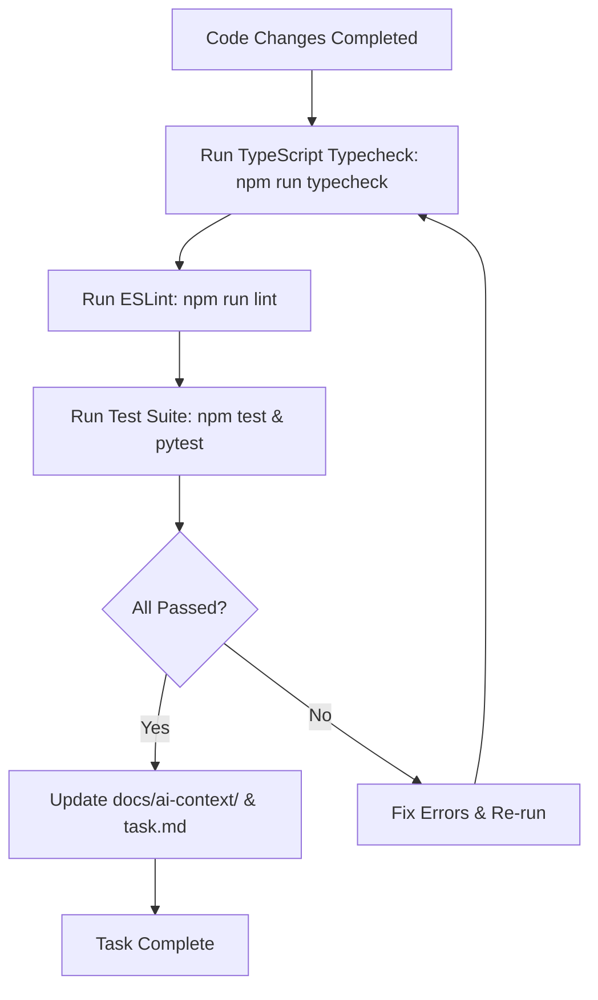

# 07 — AI Development Rules & Directives

**Document:** 07_AI_DEVELOPMENT_RULES.md  
**Owner:** Engineering Council & Lead Architect  
**Status:** Active & Non-Negotiable  

---

## Executive Summary

This document contains **MANDATORY, NON-NEGOTIABLE DIRECTIVES** for all artificial intelligence models, agentic workflows, and automated coding tools (including Antigravity, Cline, GitHub Copilot, Cursor, and custom subagents) operating within the Sathus Platform repository.

These directives ensure that AI assistants maintain production-grade code quality, respect Clean Architecture boundaries, reuse existing components, prevent technical debt, and never degrade platform performance or security.

---

## Ten Non-Negotiable AI Rules

### Rule 1: Zero Code Duplication
> **NEVER duplicate components, utility functions, types, or configuration settings.**  
Before writing any new function, UI component, or schema, search the codebase (`packages/ui`, `packages/utils`, `packages/types`, `packages/config`, `apps/web/src/components`, `apps/admin/src/lib`). Re-use existing implementations.

### Rule 2: Preserve Completed UI & Architecture
> **NEVER redesign completed UI features or alter functional architectural patterns without explicit human instruction.**  
Existing components (such as Content Editor, Version History LCS Diff, Hospital Analytics Dashboard, Theme Providers) represent approved, validated milestones. Do not arbitrarily modify working visual designs or layout structures.

### Rule 3: Explicit React Imports
> **ALWAYS include `import React from 'react';` at the top of all `.tsx` component files.**  
Even if Next.js supports implicit JSX, test execution frameworks (Vitest, JSDOM, ESM transformers) require explicit `React` in scope to prevent `ReferenceError: React is not defined` errors.

### Rule 4: Clean Architecture Layering
> **ALWAYS respect Clean Architecture and DDD boundaries.**  
- Presentation layer (`components/`, routers) must NOT query database drivers directly.
- Domain models must NOT import HTTP controllers or UI libraries.
- Infrastructure code must implement domain repository interfaces.

### Rule 5: Production-Ready Code Quality
> **NEVER write placeholder functions, mock implementations, or temporary 'TODO' stubs in production paths.**  
All code submitted by AI MUST be fully implemented, strictly type-safe, error-handled, and ready for immediate deployment.

### Rule 6: Synchronous Documentation Maintenance
> **ALWAYS update handbook files, docstrings, and OpenAPI specs when code changes.**  
If an API endpoint, data model, or configuration setting is modified, the corresponding documentation in `docs/ai-context/` MUST be updated in the same commit.

### Rule 7: Synchronous Test Coverage
> **ALWAYS write or update tests alongside feature changes.**  
Code changes without corresponding unit/integration tests in Vitest (`apps/web`, `apps/admin`) or Pytest (`apps/api`) will be automatically rejected.

### Rule 8: Migration & Schema Integrity
> **ALWAYS create database migration scripts when modifying model structures.**  
Changes to SQLAlchemy models (`apps/api`) require an Alembic migration script. Changes to EF Core models (`src/*`) require an EF Core migration.

### Rule 9: Backward Compatibility
> **NEVER introduce breaking changes to public APIs, shared package contracts, or database schemas.**  
Deprecate fields gracefully before removal. Maintain contract stability for multi-tenant clients.

### Rule 10: Strict Type Safety
> **NEVER use `any` type overrides or ignore TypeScript/Python linting rules.**  
All types must be explicitly defined using TypeScript interfaces or Pydantic/Zod schemas.

---

## Pre-Commit AI Verification Checklist

Before reporting task completion to the user, an AI agent MUST perform the following verification:

