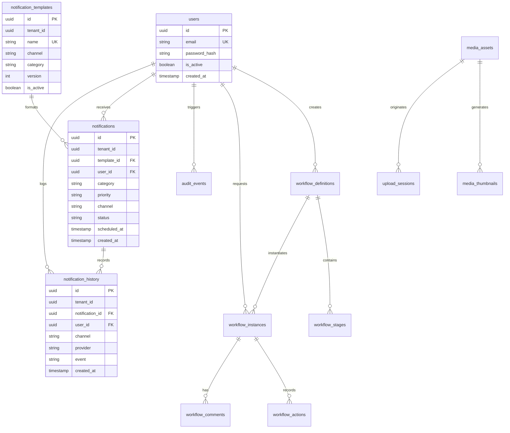

# 11 — Database Architecture

**Document:** 11_DATABASE_ARCHITECTURE.md  
**Owner:** Lead Database Architect & Staff Backend Engineer  
**Status:** Active  

---

## Executive Summary

The persistence tier of the Sathus Platform is built on **PostgreSQL 16+**, utilizing a dual ORM mapping pattern:
1. **Async SQLAlchemy 2.0 (`apps/api`)**: Python microservices persistence with explicit async sessions.
2. **Entity Framework Core 9 (`src/*`)**: .NET 9 Clean Architecture persistence with LINQ queries and migration snapshots.

This document outlines relational schemas, model relationships, migration practices, connection pooling, and multi-tenancy data isolation.

---

## Relational Entity-Relationship Diagram (ERD)



---

## Core Database Models & Schemas

### Python SQLAlchemy Async Models (`apps/api`)

#### User Model (`apps/api/app/identity/infrastructure/models.py`)
```python
from sqlalchemy import Column, String, Boolean, DateTime, func
from sqlalchemy.dialects.postgresql import UUID as PostgresUUID
from app.core.database import Base

class User(Base):
    __tablename__ = "users"
    __allow_unmapped__ = True

    id = Column(PostgresUUID(as_uuid=True), primary_key=True, default=func.uuid_generate_v4())
    email = Column(String(255), unique=True, nullable=False, index=True)
    password_hash = Column(String(255), nullable=False)
    is_active = Column(Boolean, default=True)
    created_at = Column(DateTime(timezone=True), server_default=func.now())
    updated_at = Column(DateTime(timezone=True), onupdate=func.now())
```

#### Notification & History Models (`apps/api/app/notification/infrastructure/models.py`)
```python
from sqlalchemy import Column, String, Text, Boolean, Integer, ForeignKey, DateTime, func
from sqlalchemy.dialects.postgresql import UUID as PostgresUUID
from app.core.database import Base

class Notification(Base):
    __tablename__ = "notifications"

    id = Column(PostgresUUID(as_uuid=True), primary_key=True, default=func.uuid_generate_v4())
    tenant_id = Column(PostgresUUID(as_uuid=True), nullable=True, index=True)
    template_id = Column(PostgresUUID(as_uuid=True), ForeignKey("notification_templates.id"), nullable=True)
    user_id = Column(PostgresUUID(as_uuid=True), ForeignKey("users.id"), nullable=False, index=True)
    category = Column(String(50), nullable=False, index=True)
    priority = Column(String(50), default="normal")
    channel = Column(String(50), nullable=False, index=True)
    subject = Column(String(255), nullable=True)
    body = Column(Text, nullable=False)
    status = Column(String(50), default="pending", index=True)
    is_deleted = Column(Boolean, default=False, index=True)
    created_at = Column(DateTime(timezone=True), server_default=func.now(), index=True)

class NotificationHistory(Base):
    __tablename__ = "notification_history"

    id = Column(PostgresUUID(as_uuid=True), primary_key=True, default=func.uuid_generate_v4())
    tenant_id = Column(PostgresUUID(as_uuid=True), nullable=True, index=True)
    notification_id = Column(PostgresUUID(as_uuid=True), ForeignKey("notifications.id"), nullable=False, index=True)
    user_id = Column(PostgresUUID(as_uuid=True), ForeignKey("users.id"), nullable=False, index=True)
    channel = Column(String(50), nullable=False)
    provider = Column(String(50), nullable=True)
    status = Column(String(50), nullable=False)
    event = Column(String(100), nullable=False, index=True)
    created_at = Column(DateTime(timezone=True), server_default=func.now(), index=True)
```

---

## Migration Management Protocol

1. **Python Alembic Migrations (`apps/api`)**:
   - All schema changes in `apps/api` MUST be generated via Alembic:
     ```bash
     alembic revision --autogenerate -m "004_create_notification_tables"
     alembic upgrade head
     ```
   - Migration scripts MUST be checked into source control alongside model updates (`alembic/versions/`).

2. **EF Core Migrations (`src/*`)**:
   - All schema changes in .NET microservices MUST use EF Core migrations.

---

## Connection Pooling & Performance Tuning

- **Pool Size**: Default pool size = 10 connections per application node, with `max_overflow = 20`.
- **Pre-Ping**: `pool_pre_ping=True` enabled on all engines to prevent stale connection drops.
- **Indexing Standard**: B-tree indexes MUST be created on all foreign keys, lookup slugs (`slug`), email fields, and filter flags (`tenant_id`, `status`, `channel`, `category`).
